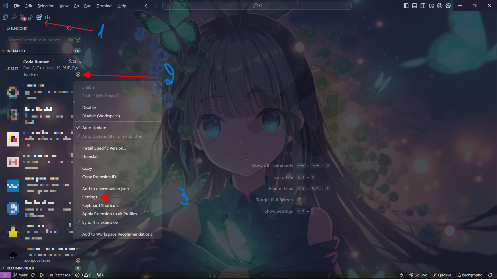
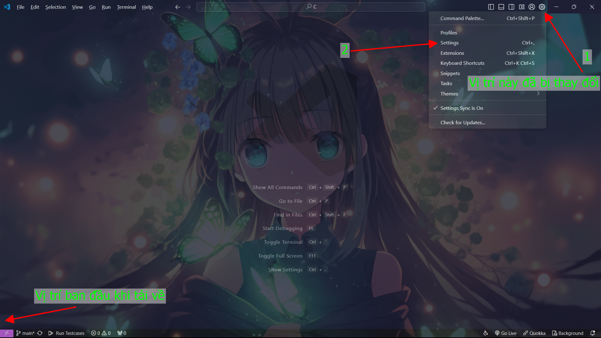
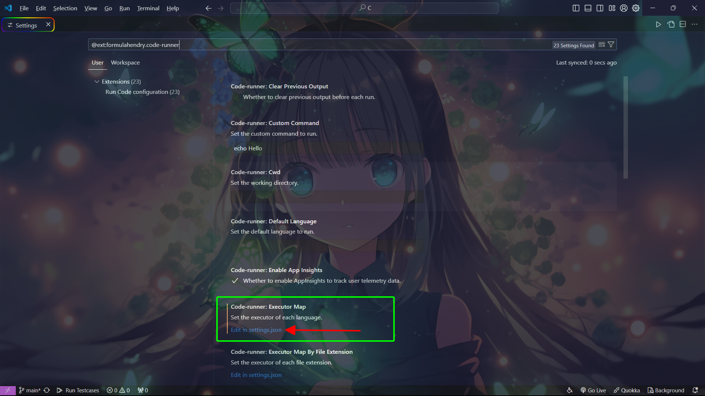
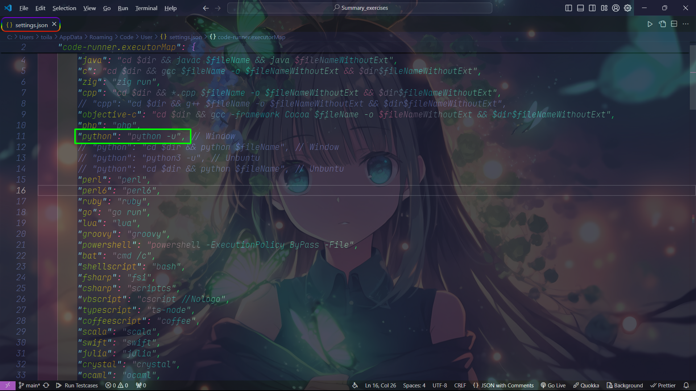
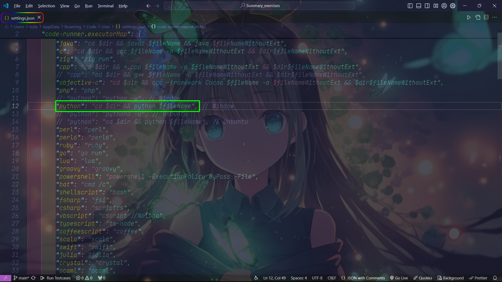
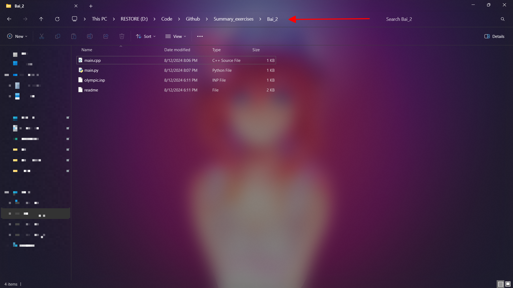
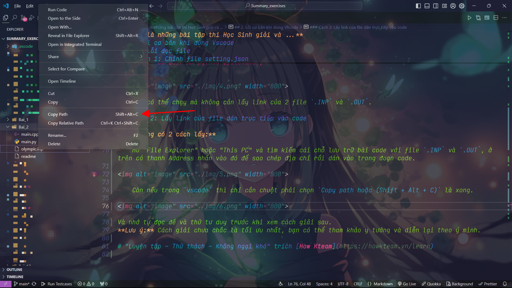

# Tổng hợp của Python

|  |
|----------|

## Giới thiệu về Repository

Tổng hợp các đủ loại.

### Thiếu thư viện

Vì viết bằng `Text editor: Visual Studio Code` [(vscode)](https://code.visualstudio.com/) + môi trường trực tiếp trên máy [python 3.10.9](https://www.python.org/downloads/release/python-3109/).
Trong đây có thể có rất nhiều thư viện bạn chưa tải.

Mở `terminal` (ctrl + `) rồi nhập như sau:

```bash
pip install nameLibrary
```
**Lưu ý:** có số 1 thư viện khá là lỗi khi tải.

*Ví dụ:* repository này có dùng thư viện PIL. Khi tải về nhận được thông báo như này:

```bash
ERROR: Could not find a version that satisfies the requirement PIL (from versions: none) 
ERROR: No matching distribution found for PIL 
```
Thì bạn có thể sử dụng gói thay thế cũng sẽ chạy được PIL là:

```bash
pip install Pillow
```
Và nhiều thư viện khác bạn có thể lên trên mạng search tìm kiếm.

### Lỗi đọc file

**Mô tả lỗi:**

`Vscode` sẽ không đọc được file data là do cách viết lệnh gọi file `main` thực thi chương trình. Thì tôi dùng extension [code runner](https://marketplace.visualstudio.com/items?itemName=formulahendry.code-runner) để giúp chạy code nên sẽ bị vấn đề này (nên các bạn tự tay viết lệnh thực thi thì cũng có thể tham khảo).

**Có 2 cách khắc phục:**

#### Cách 1: Chỉnh file setting.json

_Bước 1:_ Vào settings của extension

Cách 1: Vào nhấn vào `Extensions` (ctrl + shift + x) như vị trí số 1 trong ảnh >> Tìm `code runner` >> Chọn `bánh răng` như vị trí số 2 trong ảnh >> Chọn `settings` như vị trí số 3 trong ảnh.



Cách 2: Nhấn vào bánh răng có tên `Manage` (ctrl + ,) gần `accounts` như vị trí số 1 trong ảnh >> Chọn `settings` như vị trí số 2 trong ảnh >> Chọn vào extension `code runner`.



_Bước 2:_ Tìm `Code-runner: Executor Map` >> nhấn vào `Edit in setting.json`.



_Bước 3:_ Hiện ra kiểu dữ liệu `JSON (JavaScript Object Notation)`

Với mặc định thì Python sẽ như này:

```
"python": "python -u",
```



Và bạn chỉ cần sửa đoạn code thành như này:

```
"python": "cd $dir && python $fileName",
```



Bây giờ có thể chạy mà không cần lấy link của 2 file `.INP` và `.OUT`.

#### Cách 2: Lấy link của file dán trực tiếp vào code

**Này cũng có 2 cách lấy:**

-   Mở "File Explorer" hoặc "This PC" và tìm kiếm cái chỗ lưu trữ bài code với file data, ở trên có thanh Address nhấn vào đó để sao chép địa chỉ rồi dán vào trong đoạn code.



-   Còn nếu trong `vscode` thì chỉ cần chuột phải chọn `Copy path` (Shift + Alt + C) là xong.



### Debug python

Bạn có thể tham khảo của vscode tạo ở đây [instruct](https://code.visualstudio.com/docs/python/debugging#_debugging-specific-app-types)